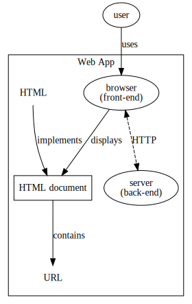

# Web Dev: A Bird's-eye View for Novice Web Developers to Speed Up Learning

## 0. Overview

The idea way of reading this tutorial is to begin with the first section and go all the way to the end. The knowledge to understand earlier sections does not depend on the later sections.

## 1. The World First Web Site

### 1.1 How The First Web Site Came Into Being

When [Tim Berners-Lee](https://www.w3.org/People/Berners-Lee/) worked at [CERN](https://home.cern/), he found that information was scattered on many different computers and there was no easy way to access all in once. People had to log in different computers to get different information and "sometimes you had to learn a different program on each computer." [1]

To solve this problem, he proposed the initial idea of an information management system that "used hypertext to link documents on different computers that were connected to the Internet." [1] By the end of 1990, he had developed the key technologies including

- [**Hypertext Markup Language (HTML)**](https://developer.mozilla.org/en-US/docs/Learn/Getting_started_with_the_web/HTML_basics) describes what contents to display.
- [**Uniform Resource Locators (URLs)**](https://developer.mozilla.org/en-US/docs/Learn/Common_questions/What_is_a_URL) specifies the unique address of a resource (typically a document) on the web so people can find the resource.
- [**Hypertext Transfer Protocol (HTTP)**](https://developer.mozilla.org/en-US/docs/Web/HTTP) is the communication protocol between the client side and the server side.
- A simple browser.
- A web server program.

On August 6th, 1991, he published the [first website in the world](http://info.cern.ch/).

The ["World First Website (Mock!)"](Code/World-first-website-mock/README.md) is a simple website that is made to look like the world's first website. You can run it on your local computer. Check its README file for details.

### 1.2 Architectural View

Overall, a web site is in a [server-client architecture](https://en.wikipedia.org/wiki/Client%E2%80%93server_model). The server side (the server program) is called the **back-end** while the client side (the browser) is called **front-end**.

Therefore, to learn how to build a web site, you need to learn both back-end and front-end technologies. There are engineers that dedicated to the technologies on one end, but there are also those who understand the entire technology stack and are called "full-stack engineers."

### 1.3 The First Website's Characteristics

The first website has only **static** content: it's a bunch of web pages that show information without fancy visual effects or dynamic interaction. In fact, the simple browser Tim Berners-Lee developed supported some visual styles, but the styling work was left to the browsers thus was not standardized. As you'll see below, people soon found out the need for styling (so CSS was developed) and dynamic interaction (so JavaScript was developed).

## 2. The Three Major Components of Front-end Development

### 2.1 The Emergence of CSS

In the early days, the web pages written in HTML primarily described the contents and structure. HTML didn't focus on the visual style and layout of the web pages because, as said in [2], "the separation of document structure from the document's layout had been a goal of HTML from its inception in 1990." **Cascading Style Sheets (CSS)** emerged as the supplementary technology to define the content style and layout.

### 2.2 The Emergence of JavaScript and DOM

With the help of HTML and CSS, one would only be able to design web pages with static content. That is, once the style and layout of a page is decided, they won't be changed when the readers read them on their browsers.

However, [Marc Andreessen](https://en.wikipedia.org/wiki/Marc_Andreessen) believed that the web content should become more dynamic, or, in another word, interactive. "Animations, interaction and other forms of small automation should be part of the web of the future." [3] As a result, **JavaScript** was created as a lightweight (by then) scripting language that could dynamically change the web page as the responses to the user's actions on the web pages (e.g., clicking a button, moving the mouse, scrolling the page).

In order to change the web page dynamically, there must be a way for JavaScript to manipulate the content or style of the web page. **Document Object Model (DOM)** was therefore developed to meet this goal. DOM represents the HTML document in a "tree" structure [4] and also provides APIs to access this tree structure. JavaScript can call these APIs to manipulate the tree, hence the web page content. See [4] for more details.

### 2.3 The Three Major Technologies

So far, the three major technologies to develop the front-end have all emerged:

- `Hyper Text Markup Language(HTML)`: Describe the content of a web page.
- `Cascading Style Sheets (CSS)`: Describe the visual effect of the web page.
- `JavaScript`: Implement the user interaction of the web page with the user so the web page content and visual effect can be dynamically changed as the user interacts with it.

The sample website ["FE-three-major-components"](Code/FE-three-major-components/README.md) shows an enhanced version of the "World First Website (Mock!)". Check out its README file for more details.

## 3. Web Development Driving Forces

There are several driving forces that shape the web development. Some forces influenced how the technologies evolved; other forces are those you need to consider to build in your web site:

- Availability
- Backward compatibility: What if a client of newer version is communicating to an older version of server? Is this allowed? Consider versioning.
- Operation
- Performance
  - Time related: faster response. This is also related with user experience.
    - Technologies: caching (fewer hops); load balancing; long polling (immediate response); client-side validation
  - Resource related: consuming less resources (e.g., CPU, memory)
    - Technologies: caching (doesn't hit servers every time); long polling (doesn't hit servers every time); ; client-side validation
- Scalability
- Security
- User experience

## 4. A Little More on HTML and CSS

Being a novice web developer, I personally feel HTML and CSS are not that difficult to learn because of its declarative nature: you declare what you want and the browser gives that to you. The challenge is you need to learn the specification and understand the described behaviors so you can choose the right features and use them correctly.

In contrast, JavaScript is much more difficult to learn because it keeps evolving and many related technologies were developed to make the web surfing experience better. Therefore, to understand why JavaScript has a specific feature or why a technology was developed, one needs to know what aspects to consider when developing a web application.

## 5. Much More on JavaScript

### 5.1 Overview

While HTML and CSS are not that difficult to learn, I personally find the JavaScript part raises the bar quite high for novice web developers. Although there are tutorials for each JavaScript-related technologies, they usually fail to give the readers an overview of how that technology fits into the big picture of the JavaScript ecosystem. Because of the lack in the big picture, when these tutorials start to refer to other technologies or jargons, the readers may get confused quite quickly. This section is trying to fix this. It puts the pieces together to show you the big picture of the JavaScript-related technologies, resolves some common misconceptions, and explains the jargons and how they are related.

### 5.2 JavaScript and Java

They are two different languages. They don't have much connection to each other. The point is: When you need to know how a JavaScript feature works, read its documentation. Do **NOT** try to figure out its behavior using your knowledge of Java's similar-looking features. That will hurt you some day, now or later.

The [interview](https://www.infoworld.com/article/2653798/application-development/javascript-creator-ponders-past--future.html) to the JavaScript creator [Brendan Eich](https://en.wikipedia.org/wiki/Brendan_Eich) has this dialog to explain why JavaScript was called "Java":

> **InfoWorld**: As I understand it, JavaScript started out as Mocha, then became LiveScript and then became JavaScript when Netscape and Sun got together. But it actually has nothing to do with Java or not much to do with it, correct?
>
> **Eich**: That's right. It was all within six months from May till December (1995) that it was Mocha and then LiveScript. And then in early December, Netscape and Sun did a license agreement and it became JavaScript. And the idea was to make it a complementary scripting language to go with Java, with the compiled language.

You can read more [on the Wikipedia about how its name was changed in the early days](https://en.wikipedia.org/wiki/JavaScript#Beginnings_at_Netscape).

### 5.3 JavaScript and ECMAScript

JavaScript was created at Netscape, who later submitted it to [ECMA International](http://www.ecma-international.org/) for standardization, and [ECMAScript](http://www.ecma-international.org/publications/standards/Ecma-262.htm) is the name of the specification. Its index is `ECMA-262` and the ISO number is [`ISO/IEC 16262`](https://www.iso.org/standard/55755.html), which you can find on [ECMA's list of standards](http://www.ecma-international.org/publications/standards/Standard.htm).

In sum:

- `ECMAScript` is the name of the standard specification.
- `JavaScript` is the most popular implementation of the ECMAScript specification, but not the only one. [`ActionScript`](https://www.adobe.com/devnet/actionscript.html) and [`JScript`](https://msdn.microsoft.com/library/hbxc2t98.aspx) are the other well-known implementations.

### 5.4 ECMAScript Versions

You may hear people talking about "ECMAScript 6" or "ECMAScript 2015". You may be confused by how ECMAScript is versioned. [This page from W3Schools](https://www.w3schools.com/js/js_versions.asp) has a summary of what the versions are all about.

### 5.5 Run-time Environment: Client Side and Server Side

Traditionally, the JavaScript code is executed in the browsers. Because the browsers are used by the end users on the "client" side, such code is called **"client-side JavaScript"**. In other words, you wouldn't be able to run JavaScript code outside of browsers before the "server-side" run-time environments were developed. All major browsers, such as Chrome, Firefox, Opera, Safari and IE, provide their run-time environments.

Because the client side and the server side communicate via HTTP protocol, the technology stack on one side doesn't really affect the other side. Therefore, although JavaScript is the most influencing technology of scripting on the client side, the server side doesn't have to be implemented using JavaScript. There are [a bunch of programming languages](https://en.wikipedia.org/wiki/Server-side_scripting#Languages) that can be used to implement a server program.

Nonetheless, Netscape provided their server-side JavaScript runtime ([Netscape Enterprise Server](https://en.wikipedia.org/wiki/Oracle_iPlanet_Web_Server#History)) soon after they released JavaScript for browsers. [Node.js](https://nodejs.org/en/) is a very popular server-side JavaScript runtime nowadays.

### 5.6 Run-time Environment: A Deeper Look

Alexander's article ["How JavaScript works: an overview of the engine, the runtime, and the call stack"](https://blog.sessionstack.com/how-does-javascript-actually-work-part-1-b0bacc073cf) provides a clear view of what a "run-time environment" actually consists of. You should definitely read his article. In sum, a run-time environment has the following components:

- A **JavaScript Engine** that executes the JavaScript code. The JavaScript code is executed on the browser and by the engine that the browser uses. For example, Google Chrome's (client side) engine is called [V8](https://developers.google.com/v8/) which is also used by node.js (server side) as its engine. There are [many other JavaScript engines](https://en.wikipedia.org/wiki/JavaScript_engine#JavaScript_engines), too.
- The **Web APIs** that can be called from JavaScript code to access the device hardware or the data stored on the hardware, such as the Bluetooth, battery status, camera, etc. See [7] for more details.
- The **callback queue** and **event loop**: The internal infrastructure to implement the concurrency model of JavaScript. See [8] for more details.

### 5.7 Run-time Environment Compatibilities

Unfortunately, different run-time environments, or, technically, the JavaScript engines, may implement the ECMAScript specification to different extent. If you want to target your JavaScript code to a run-time environment, you need to make sure your code doesn't use any feature that is not supported by that environment yet.

There are several online tools to check the compatibility:

- [ECMAScript Compatibility Table](http://kangax.github.io/compat-table/es6/): This comprehensive table covers not only the desktop browsers but also the mobile browsers and server-side run-times (such as Node).
- [Node Green](https://node.green/): This is a subset of the table above that's specific to Node.js.
- [Browser support for JavaScript APIs](https://developer.mozilla.org/en-US/Add-ons/WebExtensions/Browser_support_for_JavaScript_APIs)
- [Can I use ___?](https://caniuse.com/#home)

As a result, if you want to target your code to all the major browsers, you'll have to use the common set of supported language features on all of them. But there is another solution to solve this problem so that you can still use new language features but target to older browsers, which we will talk about later.

### 5.8 Modules

In the early days, JavaScript was only supported to be executed in the browsers. The JavaScript code could be embedded in the `<script>` tag in the HTML pages, and the browsers would run the script in a global context: every variable and function are defined in the global context. But [modularity](https://en.wikipedia.org/wiki/Modular_programming) has been proven a best practice in software engineering as it promotes the code reusability and prevents global namespace pollution.

JavaScript was in lack of built-in support of modules for long time. The support wasn't officially added to the standard until ECMAScript 6 (in 2015). Before that, several other solutions were proposed and implemented.

Below are the module solutions discussed in [5]:

- `Object Literal pattern`
- `Immediately Invoked Function Expression(IIFE)/Revealing Module pattern`
- `CommonJS`
  - [CommonJS](http://www.commonjs.org/) is a server side module solution. It gained popularity because of [`node.js`](https://nodejs.org)'s success because node.js, a server-side JavaScript runtime, implements CommonJS. In CommonJS, a module's members are exported via `module.export`; the consumer script refers to the module using `var m = require('module_name')`.
  - CommonJS modules are also referred to as **"CJS modules"**.
- `Asynchronous Module Definition(AMD)`
  - [AMD](https://github.com/amdjs/amdjs-api) is a client-side module solution that is suitable for asynchronous environment. While CommonJS requires all the modules be loaded before any of them can be executed, AMD allows a module to be executed as long as it and all its dependencies are loaded, despite there are more other unrelated modules not yet loaded.
- `Universal Module Definition(UMD)`
  - UMD was "an attempt to mash AMD and CJS together." [5]
- `ECMAScript 6 modules`
  - This is JavaScript built-in module solution which uses `export` to export module members and `import` to include the required modules into the consumer scripts.
  - ECMAScript 6 modules are also referred to as **"ES6 modules"**.

### 5.9 Transpilers

A transpiler, or [source-to-source compiler](https://en.wikipedia.org/wiki/Source-to-source_compiler), is a type of compiler that translates the source code that's written in one programming language into the source code in another programming language, usually at similar level of abstraction.

A traditional compiler is different from a transpiler at the abstraction level of the target code. For example, a C compiler translates the C source code into the machine code. They two are at quite different levels of abstraction, so it is more suitable to call it a "compiler". In contrast, a Python 2-to-3 tool translates Python 2 code to Python 3 code which is at the similar level of abstraction, so it is more suitable to call this tool a "transpiler".

But you don't have to distinguish them so clearly. People usually understand what you mean with suitable conversation context.

In the JavaScript world, there are two types of transpilers:

- One type transpiles the source code of other programming languages, such as TypeScript and CoffeeScript, into JavaScript.
- The other type transpiles the JavaScript code that uses new language features that are not supported by the browsers yet into the code that only uses the features that are well supported by all the mainstream browsers.

[Babel](https://babeljs.io/) is one of the most well-known JavaScript transpiler that belongs to the second type. On the top of their front page says:

> Babel is a JavaScript compiler.
>
> Use next generation JavaScript, today.

Its original name, "6to5", reflects the tool transpiles ECMAScript 6 code to ECMAScript 5 code. 6to5 was later renamed to Babel, as pointed out in [this blog "Not Born to Die"](https://babeljs.io/blog/2015/02/15/not-born-to-die), in order to take on more responsibilities than transpiling code.

### 5.10 Bundling and Minification

Modularity is a good engineering practice. But as [9] says:

> Modules and libraries are all in separate files, which means that each file requires a `<script>` tag in the HTML. The HTML file is loaded on page load, and separate tags for each file means the module and library files would also have to be loaded one by one. This can be a time consuming process as projects get large. In order to reduce the number of requests for loading all the modules, you can bundle them into one or a few (if there are a lot) files. This is known as the build step. As part of bundling you can also minify the code, which is removing any unnecessary characters such as new lines, white spaces and comments. This also helps speed up bundling and the build process.

But note that bundling does not have to work with JavaScript code only. In fact, all kinds of assets can be bundled: images, style sheets, JavaScript scripts, etc.. The point is: the fewer components the browser needs to load for your web site, the faster it is.

There are many bundling tools. See the section "Bundling Tools" in the "Tools".

## 6. The ".js" Hats (or Hell)

Along the way of your learning you have probably come across many "something.js" things. They all have a ".js" suffix, but they are all different tools: some are modules (Require.js); some are development frameworks (React.js); some are run-times (Node.js).

All those ".js" names can quickly become overwhelming. In fact, this is one of the many reasons I want to write this tutorial: When these ".js" magicians keep showing you their ".js" hats, you need to grab and throw them away in order to see what they really are. Once you understand all the aspects that a web developer needs to care about, you can then put every ".js" magician to the correct position and understand it immediately.

Nonetheless, a great person without ".js" is still great; a [jackass](https://www.npmjs.com/package/jackass) with a ".js" hat is still a jackass.

## 7. The Polyfills (and Ponyfills)

You may have heard people talking about "polyfills". The term "polyfill" was coined by [Remy Sharp](https://remysharp.com/about) and he talked about the history in the article [What is a Polyfill?](https://remysharp.com/2010/10/08/what-is-a-polyfill). He referred to [Paul Irish](https://www.paulirish.com/about/)'s [concise definition](https://www.paulirish.com/i/7570.png):

> A shim that mimics a future API providing fallback functionality to older browsers.

Many good articles have explained this topic well enough. I'll list them below and won't recreate the wheel.

- [A Beginner's Guide to HTML5 Cross-Browser Polyfills](https://www.sitepoint.com/html5-cross-browser-polyfills/): The highlight of this article is the explanation of polyfilling and transpiling.
- [HTML5 Part 4: Using HTML5 while retaining support for older browsers](https://blogs.msdn.microsoft.com/jennifer/2011/08/04/html5-part-4-using-html5-while-retaining-support-for-older-browsers/): This article gives an example to show how a polyfill works.
- [Your First Polyfill](https://javascriptplayground.com/writing-javascript-polyfill/): This article shows you how to implement a polyfill.

A relative but slightly different thing is called ["ponyfill"](https://github.com/sindresorhus/ponyfill). As explained in the section ["How are ponyfills better than polyfills?"](https://github.com/sindresorhus/ponyfill#how-are-ponyfills-better-than-polyfills), a `ponyfill`

> "...doesn't monkey patch anything, but instead exports the functionality as a normal module, so you can use it locally without affecting other code."

## 8. References

- [1] ["The World's First Web Site"](https://www.history.com/news/the-worlds-first-web-site)
- [2] [A brief history of CSS until 2016](https://www.w3.org/Style/CSS20/history.html)
- [3] [A Brief History of JavaScript](https://auth0.com/blog/a-brief-history-of-javascript/)
- [4] [The W3C Document Object Model (DOM)](https://www.w3.org/2002/07/26-dom-article.html)
- [5] [Understanding ES6 Modules via Their History](https://www.sitepoint.com/understanding-es6-modules-via-their-history/)
- [6] [Brief history of JavaScript Modules](https://medium.com/sungthecoder/javascript-module-module-loader-module-bundler-es6-module-confused-yet-6343510e7bde)
- [7] [WebAPI](https://developer.mozilla.org/en-US/docs/WebAPI)
- [8] [Concurrency model and Event Loop](https://developer.mozilla.org/en-US/docs/Web/JavaScript/EventLoop)
- [9] [An Introduction to Javascript Modules and Bundling](http://code.hootsuite.com/an-introduction-to-javascript-modules-and-bundling/)
